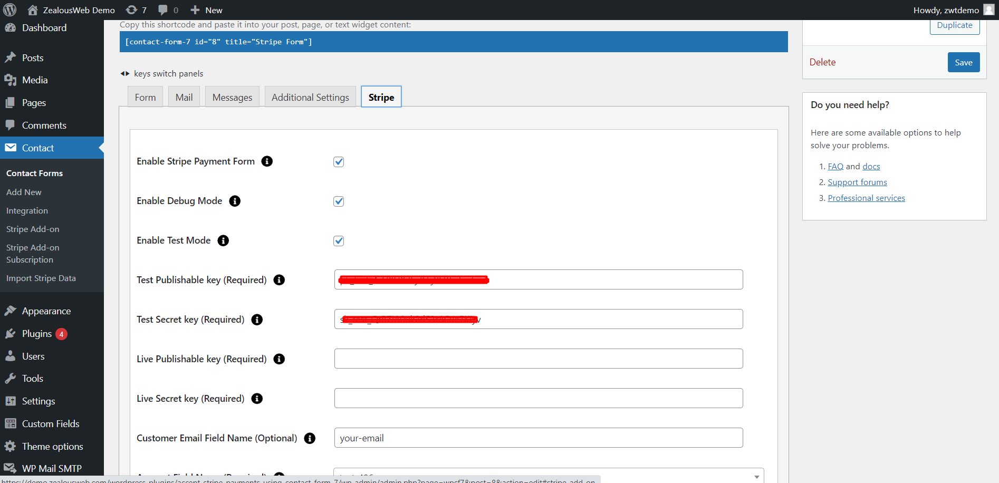

# Accept Stripe Payments Using Contact Form 7
Introducing ZealousWeb’s new way to get paid online: easily accept credit card payments on your website using Stripe and Contact Form 7. With our plugin, Accept Stripe Payments Using Contact Form 7, anyone can receive payments from customers hassle-free. Just add the plugin to your website, and any Contact Form 7 becomes a safe payment spot. Customers fill out the form, and Stripe takes care of the rest, making sure it’s quick and secure.

No need for hard setups or extra tools. It’s all about keeping things easy and safe for businesses big and small. Give our plugin a try today and watch your revenue grow without any payment headaches for your customers.
With the help of Accept Stripe Payments Using Contact Form 7, users can receive Credit Card Payments directly from Customers. The Plugin is potentially useful in receiving payments safely from any Contact Form 7 form, which is hosted on any page or post for that matter.

**Features of Accept Stripe Payments Using Contact Form 7**

- Enable Postal Code / Zip Code Field on the Card: Add an option to include a postal code or zip code field in the payment card details.
- Dynamic Payment Successful Message for Admin: Allow admins to customize and display a dynamic message upon successful payment.
- You can get paid in 25 different currencies.
- You can make various payment forms using Contact Form 7.
- It can handle input from different types of fields like dropdowns, textboxes, radio buttons, etc.
- It can take values from the website like item description, price, email, quantity, and customer info.
- You can test payments before going live.
- With the free version, you can see up to 10 payment transactions in the admin area.
- You can easily export payment data to a CSV file.
- The admin can filter and search payment data easily.
- Admins can view or delete payment data easily.
- You can use a shortcode [stripe-details] to show transaction details like ID, amount, and status.
- Both the customer and admin get emails after payment.
- You can customize the content of these emails.
- Stripe payment tag added to email content will display stripe payment response in email.
- You can set ‘Success Return URL’ and ‘Cancel Return URL’ pages to redirect after the payment transaction.

  [Learn more about the Pro version](https://store.zealousweb.com/accept-stripe-payments-using-contact-form-7-pro)

# PLUGIN REQUIREMENT
- PHP version : 5.4 and latest
- WordPress : WordPress 3.0 and latest

<strong>[Demo for Abandoned Contact Form 7 Pro](https://demo.zealousweb.com/wordpress-plugins/accept-stripe-payments-using-contact-form-7/)</strong>

# Installation
Installing the plugin is easy. Just follow these steps:

- From the dashboard of your site, navigate to Plugins –> Add New.
- Select the Upload option and hit “Choose File.”
-  When the popup appears, select the accept-stripe-payments-using-contact-form-7.zip file from your desktop.
- Follow the on-screen instructions and wait till the upload completes.
- When it’s finished, activate the plugin via the prompt. A message will display confirming activation was successful.

# How To Use
You have to configure it from wp-admin > Contact > Add/Edit Contact Forms (Contact Form 7 needs to be activated before) to use this plugin.

You will find a new tab “Stripe” along with Form, Mail, Messages, and Additional Settings, where you can make all settings related to Stripe Extension.

To add a Stripe payment form to your Contact Form 7, find the setting attributes given below:

- **Enable Stripe Payment Form**
 Check the Stripe Payment Form option for Stripe submit button activation.
 
 - **Enable Debug Mode**
 Check the Enable Debug Mode option to start transaction debugging.
 
  - **Enable Test API Mode**
 This option will allow you to set the Stripe payment process in test mode.
 
   - **Test Publishable Key (required)**
 This field is required when you have set Stripe mode for testing if your site is in test mode.
Get Your Publishable Key:
Get it from [Stripe](https://dashboard.stripe.com/login) then Developers > API Keys page in your Stripe account.

- **Test Secret Key (required)**
This field is required when you have set Stripe mode for testing if your site is in test mode.
Get Your Secret Key:
Get it from [Stripe](https://dashboard.stripe.com/login) then Developers > API Keys page in your Stripe account.

- **Live Publishable Key (required)**
This field is required to set Stripe mode to live if your site is in live mode.
Get Your Publishable Key:
Get it from [Stripe](https://dashboard.stripe.com/login) then Developers > API Keys page in your Stripe account.

- **Live Secret Key (required)**
This field is required to set Stripe mode to live if your site is in live mode.
Get Your Secret Key:
Get it from [Stripe](https://dashboard.stripe.com/login) then Developers > API Keys page in your Stripe account.

- **Amount Field Name (required)**
You have to set a name attribute to any of your fields of Contact Form 7 like drop-down menu, textbox, hidden field, radio buttons, etc., from which you need to pass amount value to Stripe website.

For example, hidden price "20" This is a hidden field with the name “price”. You will need to set “price” in this Amount Field Name of Stripe tab.

- **Quantity Field Name (optional)**
You have to set a name attribute to any of your fields of Contact Form 7 like drop-down menu, textbox, hidden field, radio buttons, etc. from which you need to pass the quantity of the item to the Stripe website.

For example, radio quantity "1" "2" "3" This is a radio button field with the name “quantity”. You will need to set “quantity” in this Quantity Field Name of Stripe tab.

- **Customer Email Field Name (optional)**
You have to set a name attribute for the text field of contact form 7 from which you need to pass the custom email of the customer to the Stripe website.

- **Description Field Name (optional)**
You have to set a name attribute for the text field of Contact Form 7 from which you need to pass the description of the item to the Stripe website.

- **Select Currency**
You can select your currency of Stripe here. There are 25 currencies supported in this plugin, and the default is set as AUD (Australian Dollar).

- **Success Return URL (optional)**
You can enter the URL of the page to redirect for a Successful Stripe Payment transaction.

- **Cancel Return URL (optional)**
You can enter the URL of the page to redirect if a transaction fails.

- **Customer Details**
- **1. First Name**
You have to select a name attribute for the first name field of contact form 7.

- **2. Last Name**
You have to select a name attribute for the last name field of contact form 7.

- **3. Company Name**
You have to select a name attribute for the company name field of contact form 7.

- **4. Address**
You have to select a tag name for the address field of contact form 7.

- **5. City**
You have to select a tag name for the city name field of contact form 7.

- **6. State**
You have to select a tag name for the state name field of contact form 7.

- **7. Zip Code**
You have to select a tag name for the zip code field of contact form 7.

- **8. Country**
You have to select a tag name for the country field of contact form 7.

**Getting Help With Plugin**

If you have any difficulties while using this Plugin, please feel free to contact us at support@zealousweb.com

We also offer custom WordPress extension development and WordPress theme design services to fulfill your e-commerce objectives.

Our professional WordPress experts provide customer-oriented development of your project within short timeframes.

Thank you for choosing a Plugin developed by ZealousWeb!
